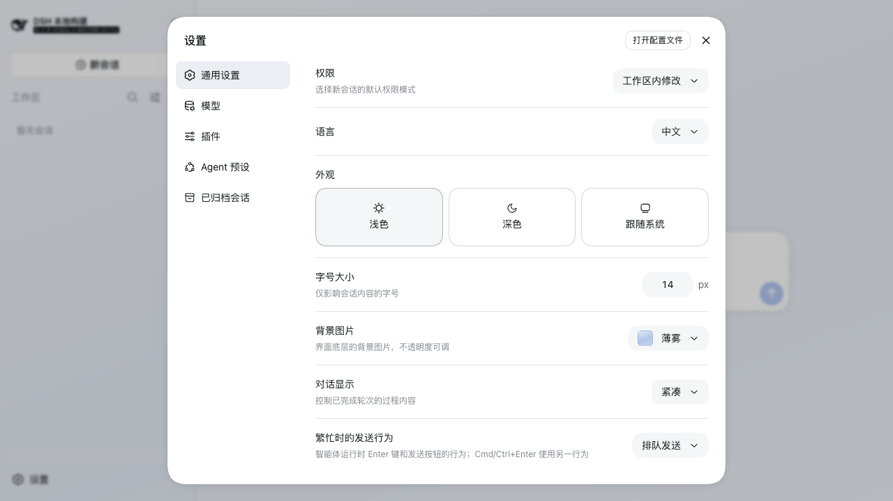
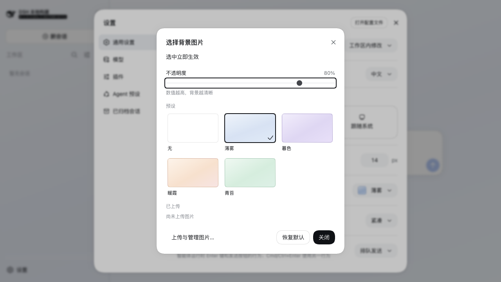
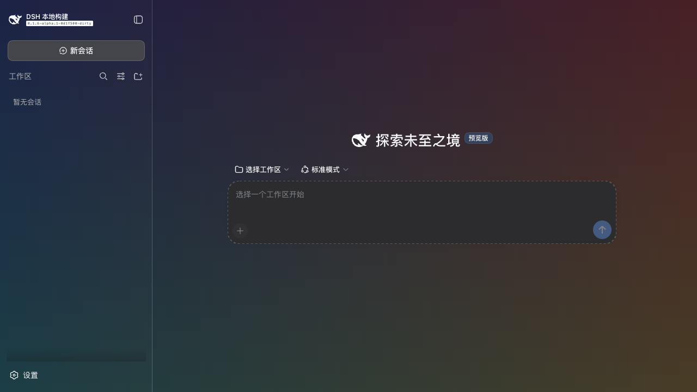

# dsh-plugin-ui-background-image

[English](README.md) | 中文

## 概述

「通用设置」里的「背景图片」行给界面铺上背景。用户可以选择五个内置背景之一、上传自己的图片，并用一个连续的不透明度控件决定它透出多少。背景覆盖整个界面，包含左侧侧边栏。选择立即生效并持久保存。本包以 profile bundle 形式安装：`dsh plugin --profile web add dsh-plugin-ui-background-image` 加入该行，移除本包即移除该行。

## 目录

- [使用本包](#use-this-package)
- [理解实现](#understand-the-implementation)
- [进一步探索](#further-exploration)
- [模型体验](#model-experience)
- [已知限制与延期工作](#known-limitations-and-deferred-work)

-----

<a id="use-this-package"></a>
## 使用本包

### 安装到 profile

```text
dsh plugin --profile web add dsh-plugin-ui-background-image
dsh plugin --profile web remove dsh-plugin-ui-background-image
```

本包声明了 `dsh.bundle.patch`，因此 `add` 会把它记入 profile 的 `dsh.profile.bundles` 并应用其覆盖层，把 `ui-background-image` 一行插入配置树。重启 `dsh web` 后，该行出现在「设置 → 通用设置」，位于「字体」下方。

从 npm 安装使用已发布的产物；从 git ref 或源码目录安装会在本机构建一次。pnpm 默认拦截构建脚本，直到 profile 的 `pnpm-workspace.yaml` 放行：按首次尝试打印出的 `allowBuilds` 一行配置即可。

### 提供的内容

- **「背景图片」行**在行内直接显示当前背景，并打开选择器。
- **选择器**列出五个内置背景——无、薄雾、暮色、暖霞、青苔，每一个都分别带浅色与深色两套取值——本部署保存的每一张图片，以及一个图片地址输入框。每个方块预览的是界面自身的合成结果：不透明度对应的表面色叠在该背景之上。
- **远程图片 URL** 只由浏览器直接加载，Host 从不代取，并且必须先通过 Host 的判定。这里有三种规则，只有第一类是「保证」：让存下的值保持良构（文档与画布都能承载的绝对 URL），以及谁有资格写它（部署自己的请求门禁）；部署用 `remoteImageAccess` 选择的「目的地规则」（默认 `strict`）；以及从别人主机加载图片必然带来的代价，统一列在限制一节。
- **不透明度控件**决定界面各层表面透出多少，从 0（背景完全看不见，界面精确回到 harness 自带配色）到 100（背景最强），拖动过程中即时生效，松手时写入一次。
- **管理对话框**用于上传图片（`.png` `.jpg` `.jpeg` `.webp` `.gif` `.avif`，默认单个 20 MiB）、删除图片，并显示文件所在目录。
- **背景在页面脚本运行之前就已绘制**，取值来自 Host 解析出的设置文档，因此刷新页面不会先闪出默认背景。







### 配置

字段均可选，写在 profile 自己的 `$DSH_HOME/profiles/web/cordis.patch.yml` 中：

```yaml
- id: ui-background-image
  config:
    defaultBackground:
      source: preset
      id: mist
      opacity: 80
```

| 字段 | 默认值 | 含义 |
|---|---|---|
| `imageDir` | `$DSH_HOME/backgrounds` | 保存上传图片的目录。这里显式设置的路径若无法创建，插件在加载时即失败；默认路径只记录一条告警。 |
| `dshHome` | `$DSH_HOME`，其次 `~/.dsh` | 覆盖本包解析路径所用的 harness 主目录。 |
| `maxUploadBytes` | `20971520` | 单个上传的大小上限（字节）。页面会在读取文件之前拒绝更大的文件；目录尚未回应前使用本包自带的默认值。 |
| `remoteImageAccess` | `strict` | 远程图片 URL 的「目的地规则」：`strict` 要求 `https`、主机名而非地址、不得是本地保留名，且写时必须解析到公网地址；`any` 只保留「存下的值本身良构」这一条。 |
| `remoteImageHosts` | 无 | 远程图片 URL 可以指向的主机名，每项是裸主机名或 `*.后缀`。不设置则不额外限制主机；设为空数组即拒绝所有远程图片。两种模式下都生效。 |
| `defaultBackground` | `{ source: preset, id: none, opacity: 65 }` | 用户未选择时使用的背景，也是「恢复默认」回到的取值。 |

`defaultBackground.source` 取 `preset`、`upload` 或 `remote`：`id` 指向内置预设或已保存的图片，`url` 是 `remote` 选择要加载的 `https` 图片。用户自己的选择始终优先。本包无法执行的值——非整数的上限、本构建不提供的预设 id、图片目录无法容纳的 id——在加载时即失败，而不是等到第一次使用。

### 上传图片的存放位置

`$DSH_HOME/backgrounds`，默认即 `~/.dsh/backgrounds`，与 `settings.yaml` 相邻。管理对话框会显示当前使用的路径。

- 只有这一个目录需要备份、迁移或删除；浏览器端不保存任何东西。
- 直接往目录里复制图片即可被识别，直接删除同样生效，都不需要打开设置页面。
- 保存的文件名为 `<名称>-<16 位十六进制>.<扩展名>`；扩展名依据文件字节而非上传时的名字。写入先落暂存文件再改名到位。
- 提供给浏览器的图片来自运行 `dsh` 的机器，因此本部署上所有连上来的浏览器都能看到；而目录路径只告知该机器上的浏览器。

### 卸载

```text
dsh plugin --profile web remove dsh-plugin-ui-background-image
```

这会移除该行并停止提供图片。有两样东西会留下：

- **已上传的文件**位于 `$DSH_HOME/backgrounds`。删除该目录即可清除，也可以保留以便日后重新安装本包。
- **已保存的选择**位于 `$DSH_HOME/settings.yaml` 的 `ui-background-image` 之下。没有本包时它是惰性的，可以随包一起删除。

### Host 不在本机时

每条路由都注册在共享 API 通道 `ctx.connection.fetch` 上，因此部署自己的 Host/Origin 门禁与浏览器认证先于这里任何处理器运行：不持有浏览器凭据的进程既读不到图片目录，也存不了文件，更无法替已认证的浏览器决定背景。上传的图片随后提供给任何能访问 Host 的浏览器——其他机器上的浏览器可以选择并看到文件，而目录路径只在请求以「本机」之名到达时才告知，因此复制文件进去始终是本机操作。

-----

<a id="understand-the-implementation"></a>
## 理解实现

<details>
<summary>实现细节——点击展开</summary>

本包分为 Host 半边与浏览器半边，由 `package.json`（`dsh.client` 与 `./client` 导出）连接。Host 半边注册设置命名空间、持有图片目录、应答 HTTP 路由并注入插件运行前的行；浏览器半边渲染设置行与两个对话框，并把每次改动投射到文档上。

| 路径 | 作用 |
|---|---|
| `src/index.ts` | Host 插件主体：配置解析、设置命名空间、索引注入行、路由注册。 |
| `src/background-fetch-routes.ts` | 目录、图片、上传、删除与远程批准路由，注册在共享 API 通道上；每条路由的处理器运行前，该通道已完成认证。 |
| `src/background-remote.ts` | 两半共用的远程 URL 策略：`https`、无凭据、主机名而非地址、非本地名，以及部署的白名单。 |
| `src/background-remote-approval.ts` | Host 对「主机名解析到什么」的判定，以及首屏所查的已批准记录。 |
| `src/user-backgrounds.ts` | 图片目录：保存、列出、读取与删除文件。 |
| `src/background-files.ts` | 由起始字节判定容器类型，以及由存储名得出可读名称。 |
| `src/background-canvas.ts`、`src/background-opacity.ts` | 画布规则、两个 token 取值，以及从用户不透明度到表面 alpha 的唯一映射。 |
| `src/background-presets.ts`、`src/background-selection.ts` | 内置背景，以及从持久化选择到画布取值的解析。 |
| `src/background-settings.ts`、`src/background-settings-schema.ts` | 设置命名空间、存储 id 规则，以及 Host 注册的 schema。 |
| `src/boot-background.ts` | 写入所服务页面的插件运行前的行。 |
| `src/client/` | 设置行、选择器、管理对话框、运行时，以及安装画布的主题 token 层。 |

三个决定塑造了其余部分。**图片画在 body 画布上，界面各层表面在其上变得半透明**：本插件拥有一条读取自有变量 `--dsh-ui-background-image` 的样式规则，并覆盖覆盖整个界面的两个官方 token——表面的 `--dsw-alias-bg-base` 与侧边栏列的 `--dsw-specific-sidebar-fill`——把它们替换为调色板自身颜色的半透明派生值。这些取值仍是合法颜色，因此所有官方消费方——`background`、`background-color`，以及由 `color-mix(...)` 构成的渐变带——都照常工作，被替换的东西不超出这两个有据可查的 token。**强度由一个控件决定**：不透明度到 alpha 的映射各只有一处定义。表面保留 `Math.round(100 - 64 × 不透明度 ÷ 100)`，因此 0 时完全不透明，默认的 65 停在 58%，100 时仍保持 36%——足以让照片之上的正文可读。侧边栏的填充色会被画两次，一次在列上、一次在列内元素上，所以它自己的 alpha 取 `1 - √(开放度)`：这个值的平方让侧边栏透出的画布量与它旁边的会话区域完全一致，且在 0 时同样回到完全不透明。**首屏绘制来自设置文档而非猜测**：Host 把解析出的背景作为一段头部样式加一段 body 脚本渲染进索引页，脚本按当前模式把取值写到浏览器半边写入的同样三个属性名上，于是主题呈现器回收时会把它们一并移除。

`source` 与 `id` 在同一次写入中移动，因为单独写入 `source` 会拿上一个 `id` 去校验。不透明度单独写入一次，每次拖动结束只写一次。

</details>

-----

<a id="further-exploration"></a>
## 进一步探索

- [打包与安装插件](https://github.com/deepseek-ai/deepseek-harness/blob/master/docs/user/develop/basic/publish.md)——本包安装所用的 bundle、profile 与层级顺序。
- [添加设置卡片](https://github.com/deepseek-ai/deepseek-harness/blob/master/docs/cookbook/adding-a-settings-card.md)——本行使用的设置命名空间与 slot 注册。
- [Web 样式](https://github.com/deepseek-ai/deepseek-harness/blob/master/docs/web-styling.md)——所安装画布遵循的 token 与样式规则。
- [ui-theme](https://github.com/deepseek-ai/deepseek-harness/tree/master/packages/client/ui-theme)——本包写入其 token 层的主题服务。
- [许可证](LICENSE)——MIT。

-----

<a id="model-experience"></a>
## 模型体验

无。本包是浏览器侧 UI 插件层，不注册任何面向模型的东西。

#### KV Cache 影响

无；本包既不组装也不发送 provider 请求。

## 已知限制与延期工作

<a id="known-limitations-and-deferred-work"></a>

这些限制是本包当前的约束，界定了背景改变不了什么、以及本部署不做哪些事。

- **背景是绘制，不是布局**——图片画在界面之后的 body 画布上，从不参与布局；背景无法让任何东西重排、换样式或隐藏。
- **照片之上的文字由用户自己拿捏**——不透明度为 100 时，各层表面仍保留 36% 的调色板基色，足以让内置背景之上的正文可读。局部对比强烈的照片位于嵌套卡片之下时仍可能让文字更难读，降低不透明度即是解法。
- **自带表面色或侧边栏色的主题在安装背景期间会被取代**——只要有背景要显示，本包就覆盖 `--dsw-alias-bg-base` 与 `--dsw-specific-sidebar-fill`；选择回到「无」时它自己的层即被移除。
- **摆放方式是居中铺满且固定**——图片填满视口，不随文档滚动；没有平铺、没有 `contain`，也没有裁剪控制。
- **没有缩略图**——选择器方块加载的是存储文件本身，因此图片较大时，每个滚入视野的方块都会产生一次完整下载；本插件存储的图片之后会被永久缓存，而用户手工复制进目录的名字会带上其字节的写入时间，已经持有的浏览器重新校验时得到不带正文的 `304`，不必再下一遍。
- **动图会动**——动画 GIF 会持续重绘，开销高于静态背景。
- **`theme-color` meta 标签报告的半透明颜色**——浏览器读到的页面外围颜色来自被覆盖的 token，只有在页面自身绘制之处才是合成后的颜色。
- **上传按单个文件设限，而非总量**——`maxUploadBytes` 限制单个文件，目录总大小不设限。
- **写入过程中崩溃可能留下一个 `.staging` 文件**——所有读取都会忽略它，它既不会被提供也不会被列出；碍事时手工删除即可。
- **桌面应用没有 web server**——本包在共享 API 通道上注册 HTTP 路由，因此在缺少 `dsh-host-webserver` 与 `dsh-client-connection` 的构建里它会保持 pending 而不会加载。
- **URL 校验决定的是第一跳，不是每一跳**——`strict` 在存储前拒绝解析到内网地址的名字，而浏览器加载图片时会再次解析，并跟随该主机给出的任何重定向。中间换了答案的主机、或重定向到策略本会拒绝的地方，都不在「校验一个 URL」能决定的范围内。要让它可强制，只能由 Host 取回字节，那会把这些请求转移到 Host 上，也正是本包不这么做的原因。
- **`any` 是部署在指挥自己的浏览器**——设为 `any` 后，`http://`、局域网地址、`file://` 路径、内嵌 `data:` 图片都会按原样存入。这是运维对「只有自己使用的 Host」的明确选择；良构规则与 `remoteImageHosts` 仍然生效。
- **远程图片依赖第三方活着**——不落地、不缓存，第三方不可达时界面就退回浏览器自身的底色，直到用户改选别的东西。
- **延期**——不做服务端缩放与缩略图、不做裁剪与平铺，也不为上传图片单独设一档强度，因为单一的不透明度控件已经表达了它。

**运行时不变式：** 不发布运行时不变式配套模块，因为每次读取目录都会重新扫描该目录，且存储 id 规则会在任何名字成为选择之前先行把关，所以持久化的选择只可能指向 Host 能提供的文件；不再能解析的名字会报告给设置行，并让 harness 自带的背景留在原位。
